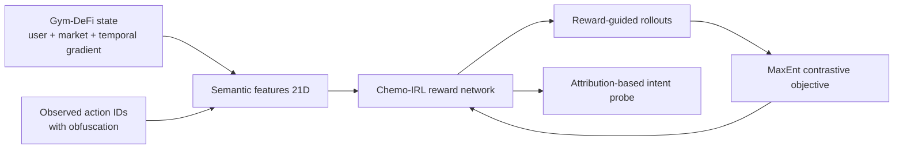

# Chemo-IRL: DeFi Intent Discovery via Maximum Entropy Inverse Reinforcement Learning

Chemo-IRL is a benchmark implementation for DeFi intent discovery via Maximum Entropy Inverse Reinforcement Learning (MaxEnt IRL).

The project models intent discovery as sequential reward inference from state-action trajectories, with a bio-mimetic temporal market-gradient state component.

## Paper-Aligned Summary

The implementation follows the paper setup:

- State: $s_t = u_t \oplus m_t \oplus \nabla_t m \in \mathbb{R}^{64}$
- Action space: $|\mathcal{A}| = N_p \times N_f \times M = 5 \times 20 \times 10 = 1000$
- Obfuscation channel during data generation with $p_{obf}=0.7$
- Reward model: 2-layer MLP ($h=64$), optimized with Adam ($\text{wd}=10^{-4}$)
- Discount factor: $\gamma = 0.99$
- Train/test split: 80/20 on 200 trajectories (seed 42)



## Main Results (Table II)

These are the benchmark values reported in the paper for the obfuscated setting.

| Method | Overall Macro-F1 | RRE (lower is better) |
| --- | ---: | ---: |
| TIM (Supervised) | 0.927 | - |
| Supervised MLP (best) | 0.901 | - |
| Action Frequency (Heuristic) | 0.092 | - |
| SQIL (Intent-label-free) | 0.474 | 0.809 |
| ValueDICE (Intent-label-free) | 0.359 | 1.049 |
| Linear GAIL (Intent-label-free) | 0.240 | 0.938 |
| Chemo-IRL (Intent-label-free) | 0.394 | 0.478 |

Repository result files corresponding to paper-level reporting:

- `evaluation_results.json`
- `ablation_results.json`

## Ablation Summary

Ablation variants in the repository follow the reduced-compute setting described in the paper discussion:

- Full model
- No temporal gradients
- Random features

The expected trend is a strong drop in complex-intent probing when temporal gradients or semantic features are removed.

## Installation

```bash
python -m venv .venv
.venv\Scripts\activate
pip install -r requirements.txt
```

## Reproduce Experiments

```bash
cd src
python run_experiments.py
```

Optional:

```bash
python run_ablation.py
python run_experiments_conservative.py
```

## Repository Layout

```text
src/
  chemo_irl.py                     Core Chemo-IRL model and Gym-DeFi simulator
  baselines.py                     Baseline methods (supervised, heuristic, label-free)
  utils.py                         Semantic feature extraction and evaluation utilities
  config.py                        Hyperparameters and taxonomy definitions
  run_experiments.py               Main benchmark script
  run_ablation.py                  Ablation script
  run_experiments_conservative.py  Conservative setting script
  test_framework.py                Framework-level tests
```

## Citation

If you use this repository, cite the work below.

```bibtex
@inproceedings{aizierjiang26chemoirl,
  title={DeFi Intent Discovery via Maximum Entropy Inverse Reinforcement Learning},
  author={Aiersilan, Aizierjiang and Jerome, Yen and Sheng, Wang},
  booktitle={2026 International Joint Conference on Neural Networks (IJCNN)},
  year={2026},
  organization={IEEE}
}
```

## License

MIT License. See `LICENSE`.
